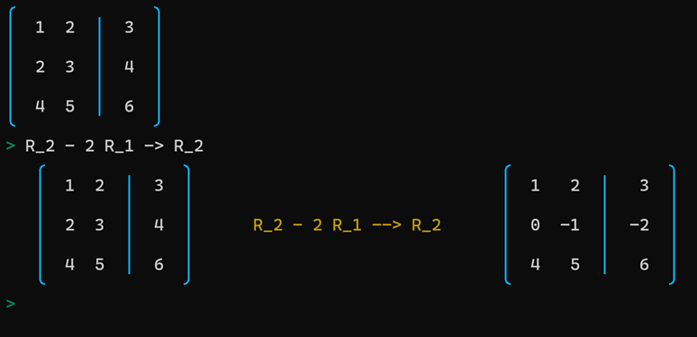
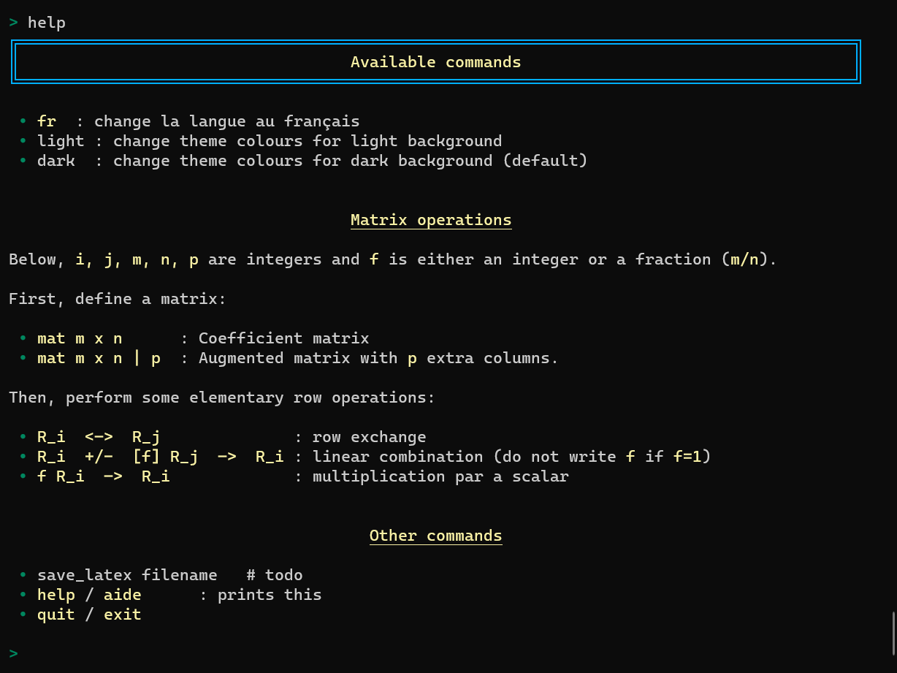

# Gauss-Jordan Assistant (gja)

Enabling live demonstration of the Gauss-Jordan algorithm in a terminal/console.

Note: this is a very early version.

## Description

The idea of this project is to enable live demonstration of using the
Gauss-Jordan algorithm to solve systems of linear equations,
using a simple console.
This project is developed on Windows but should work using other operating systems.

## Why?

## Bonus (to come)

It will be possible to save the result of all the steps using LaTeX
format, for easy inclusion (without typos!) in any LaTeX document.

## Requirements

- Python 3.8+
- Rich (https://pypi.org/project/rich/).  Rich is a fantastic project.

To work properly on Windows (which is what I use), you need the following:

- Windows Terminal (https://github.com/Microsoft/Terminal), which you can
  get from the Microsoft Store.

