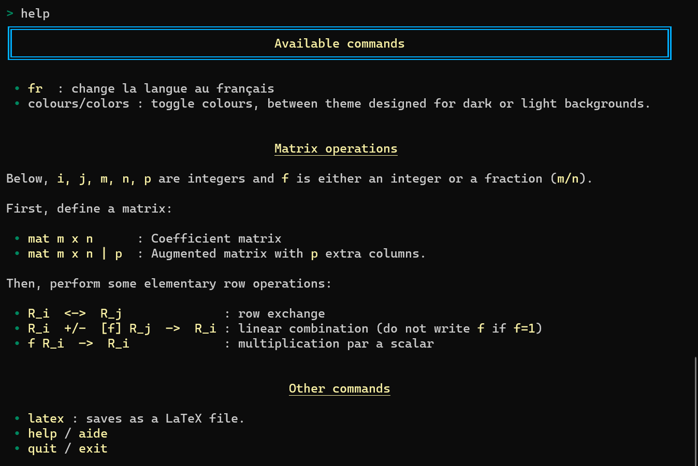

# Gauss-Jordan Assistant (gja)

Enabling live demonstration of the Gauss-Jordan algorithm in a terminal/console.

## Installation

```
pip install gja
```

## Description

The idea of this project is to enable live demonstration of using the
Gauss-Jordan algorithm to solve systems of linear equations,
using a simple console.
This project is developed on Windows but should work using other operating systems.


## Why?

I teach an introductory course in Linear Algebra by videoconference
to students who are not math majors; the focus is on calculations,
not proofs.
As I teach remotely, I share the content of my screen.
Many of the examples require, at one stage or another, that
Gaussian elimination on a matrix be performed.

In my experience, using slides with all the content
written up in advance (which is what I have mostly done until recently)
is not a good way to maintain student engagement.
My hand writing (either using a mouse or a tablet) on a computer screen
is absolutely atrocious, which makes it difficult to do "live" examples.

I have also found that a small fraction of students do not seem to understand
the basic step of Gaussian elimination, even when I attempt to
provide additional explanations via email.

This tool, which I named the Gauss-Jordan Assistant (or GJA),
allows me to do live computations on my screen in a legible way.
I have tried to design it so that each computation includes some
visual clues reinforcing some aspects of Gaussian elimination.

Using the GJA, I can ask students to suggest what should be the
next step in the computation, just as easily as I could
do it in a traditional classroom with a blackboard. If they suggest
something that is incorrect, rather than telling them up front,
I can type in their suggestion, observe the result, and follow with
relevant explanations go wrong.


## Bonus

It is possible to save the result of all the steps using LaTeX
format, for easy inclusion (without typos!) in any LaTeX document.

## Requirements

- Python 3.8+
- Rich (https://pypi.org/project/rich/).  Rich is a fantastic project.

To work properly on Windows (which is what I use), you need the following:

- Windows Terminal (https://github.com/Microsoft/Terminal), which you can
  get from the Microsoft Store.



